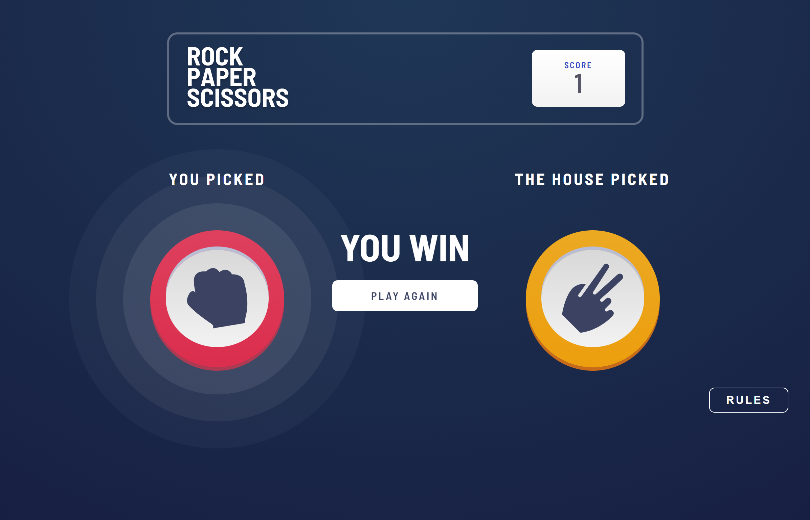

# Frontend Mentor - Rock, Paper, Scissors solution

This is a solution to the [Rock, Paper, Scissors challenge on Frontend Mentor](https://www.frontendmentor.io/challenges/rock-paper-scissors-game-pTgwgvgH). Frontend Mentor challenges help you improve your coding skills by building realistic projects.

## Table of contents

-   [Overview](#overview)
    -   [The challenge](#the-challenge)
    -   [Screenshot](#screenshot)
    -   [Links](#links)
-   [My process](#my-process)
    -   [Built with](#built-with)
    -   [What I learned](#what-i-learned)
-   [Author](#author)

## Overview

### The challenge

Users should be able to:

-   View the optimal layout for the game depending on their device's screen size
-   Play Rock, Paper, Scissors against the computer
-   Maintain the state of the score after refreshing the browser _(optional)_
-   **Bonus**: Play Rock, Paper, Scissors, Lizard, Spock against the computer _(optional)_

### Screenshot

### Links

-   Solution URL: [Solution URL](https://github.com/Andro87/rock-paper-scissors-game.git)
-   Live Site URL: [Live site URL](https://rock-paper-scissors-game-blush.vercel.app/)

## My process

### Built with

-   Semantic HTML5 markup
-   SCSS / SASS
-   Flexbox
-   CSS Grid
-   Mobile-first workflow
-   [React](https://reactjs.org/) - JS library
-   [Next.js](https://nextjs.org/) - React framework

### What I learned

The project tested my knowledge of React and strengthened some essential aspects of React's hooks, such as useState() and useEffect() while implementing it and solving the requirements.
It was also challenging to organize the general styling of the project in a way that could be optimal for the layout and the code structure.
It was a great test that made me want to keep challenging myself and improve even further.

## Author

-   Frontend Mentor - [@Andro87](https://www.frontendmentor.io/profile/Andro87)
